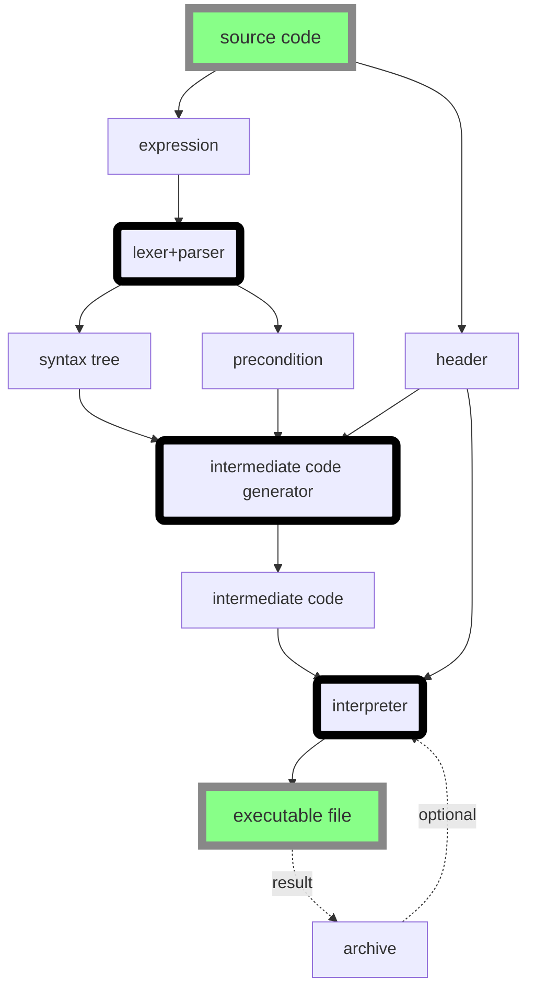

# README

## outline



## intermediate code generator

intermediate_code_generator.cpp编译成的intermediate_code_generator可执行文件从syntax_tree.txt中读入数据, 在intermediate_code.txt中输出数据, 若有错误会返回1并在log.txt中输出错误信息.


## lexer + parser + typechecker

使用方式：

```
$ make clean; make
$ ./f <input file name>  > <output file name>
```

无论成功失败都会正常终止

如果语法分析失败或者类型检查失败会在输出文件最后显示错误信息，成功则会生成完整的syntax tree表示代码

由于一些处理的问题，目前错误信息中的行号是从header的` ``` `后下一行开始计算

P.S. 对syntax做了一些小的修改，反映在了typesystem.md中，此外目前header后需要一个额外分号，示例可以见文件夹中的sample.gal，在此基础上生成了syntax_tree.txt，并且利用intermediate code generator生成了intermediate_code.txt，至少这部分都通过了。可能还有微小的问题，但需要通过其它样例程序来调试。