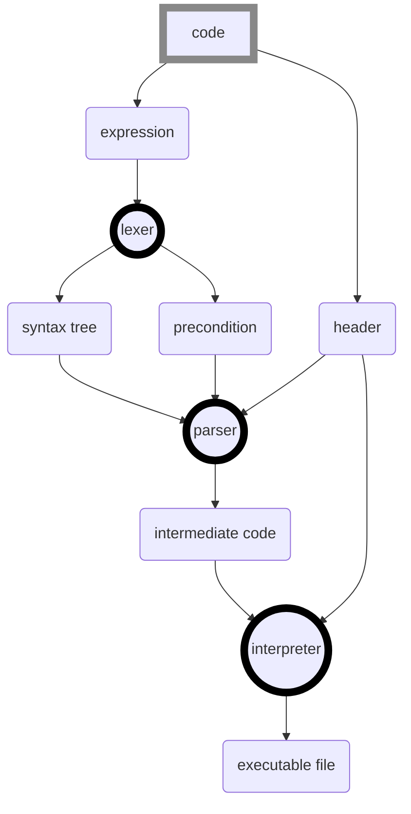

# README

## outline

```mermaid
graph TD
w[code]-->p1(expression)
w-->p2(header)
p1-->a((lexer))
p2-->b((parser))
a-->q1(syntax tree)
a-->q2(precondition)
q1-->b
q2-->b
b-->r(intermediate code)
r-->c((interpreter))
p2-->c
c-->s(executable file)

style w stroke:#888,stroke-width:8px
style a stroke:#000,stroke-width:8px
style b stroke:#000,stroke-width:8px
style c stroke:#000,stroke-width:8px

```

