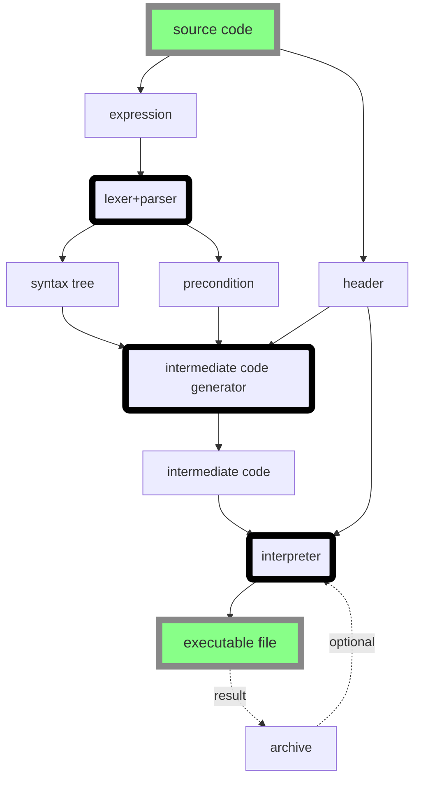

# README

## outline

```mermaid
graph TD
w[<font size=4>source code]-->p1[expression]
w-->p2[header]
p1-->a(lexer+parser)
p2-->b(intermediate code generator)
a-->q1[syntax tree]
a-->q2[precondition]
q1-->b
q2-->b
b-->r[intermediate code]
r-->c(interpreter)
q3[archive]-.->|optional|c
p2-->c
c-->s[<font size=4>executable file]
s-.->|result|q3

style w fill:#8f8,stroke:#888,stroke-width:8px
style s fill:#8f8,stroke:#888,stroke-width:8px
style a stroke:#000,stroke-width:8px
style b stroke:#000,stroke-width:8px
style c stroke:#000,stroke-width:8px

```

