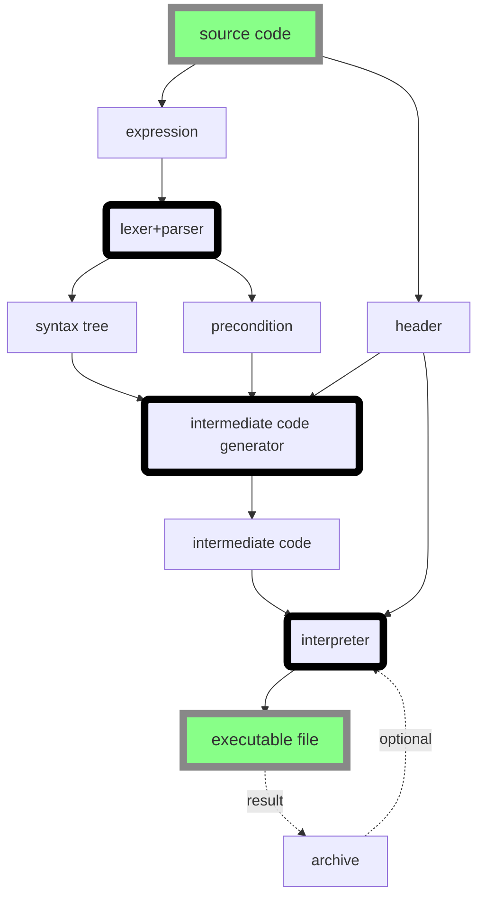

# Compiler&Player

## outline



## lexer+parser

这是在lexer+parser文件夹下了一个ocaml项目, 使用make命令来编译. 无论成功失败都会正常终止.

如果语法分析失败或者类型检查失败会在输出文件最后显示错误信息, 成功则会生成完整的syntax tree表示代码.

目前错误信息中的行号是从header的下一行开始计算.

如果你希望使用编译命令"safe", 使用make safe命令来编译.

编译结果是一个可执行文件f, 它接受一个参数, 表示源代码的位置, 并且输出语法树到标准输出流.

可以按照如下命令运行:

```
$ ./f %~1 > syntax_tree.txt
```

如果在Windows系统下, 你需要安装Cygwin并在Cygwin环境下编译和运行, 可以按照如下命令运行:

```
$ copy %~1 C:\cygwin64\home\user\code\code.gal
$ @echo off
$ C:\cygwin64\bin\bash --login -i -c  "cd code;./f code.gal > syntax_tree.txt;exit"
$ copy C:\cygwin64\home\user\code\syntax_tree.txt .\syntax_tree.txt
```

使用方式：

```
$ make clean; make
$ ./f <input file name> > <output file name>
```

## intermediate code generator

intermediate_code_generator由intermediate_code_generator.cpp编译成.

其默认输入文件是syntax_tree.txt, 也可以由命令行的第一个参数来指定.

其默认输出文件是intermediate_code.txt, 也可以由命令行的第二个参数来指定.

其默认错误信息文件是log.txt, 也可以由命令行的第三个参数来指定. 如果出错程序会有返回值1, 否则会有返回值0.

## player

解释执行中间代码进行可视化. 需要以下两个package:

* Pygame 1.9.6
* Pillow(PIL) 7.1.1

将中间代码intermediate_code.txt和播放器的文件放置在同一个目录下, 按照如下命令运行:

```
$ python run.py
```

若运行时出现错误会在命令行中给出具体的错误信息并终止运行.
